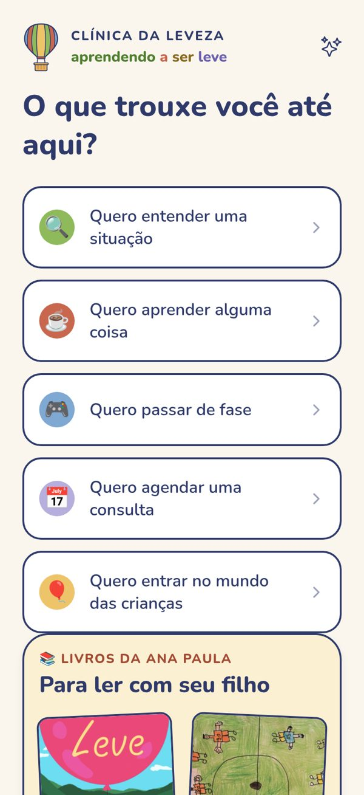
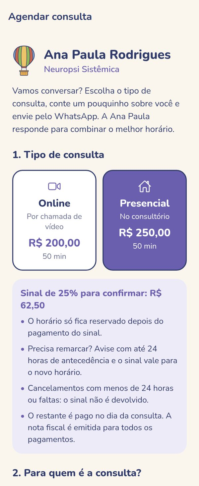
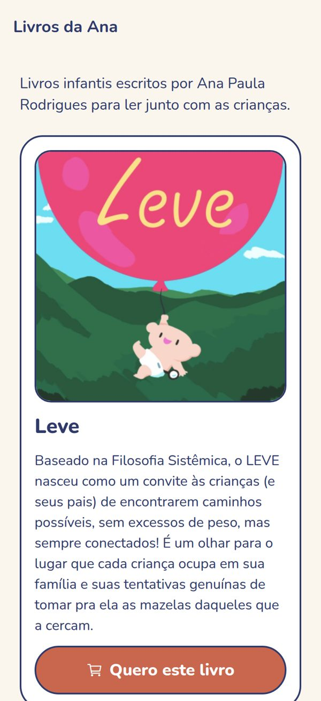

<p align="center">
  
</p>

<h1 align="center">Clínica da Leveza</h1>

<p align="center">
  <em>aprendendo a ser leve</em> · a mobile app about children's emotions, for parents and kids
</p>

<p align="center">
  
  
  
  
</p>

Clínica da Leveza is an iOS/Android app built for **Ana Paula Rodrigues**, a Brazilian systemic neuropsychology professional. It turns her work with families into short, practical content for parents — and gives children a safe space to name what they feel.

The app is in Brazilian Portuguese.

<p align="center">
  
  &nbsp;
  
  &nbsp;
  
</p>

## Features

| Area | What it does |
| --- | --- |
| **Paulada** | An animated opening line ("PAU · LA · DA!") with a short, direct phrase to pull parents out of autopilot. |
| **ManuaLeve** | Chapters from Ana Paula's book: the child's voice, an emotional translation for parents, when to seek help and a bedtime question. |
| **Cafés** | Short videos to learn a little each day. |
| **Jogos** | Everyday scenarios in levels: pick a reaction and see what it leads to. |
| **Espaço das Crianças** | A kids' area in 3 steps — how do you feel → story or mission → drawing. Large uppercase text, stars for completed missions, and an adult gate to leave. |
| **Agendamento** | Book an online or in-person consultation: a short form that opens WhatsApp with a ready message. No patient data is stored. |
| **Livros da Ana** | A showcase of the author's children's books, linking to her store. |
| **Perfil** | Optional sign-in (Google / Apple) to keep favorites, children's nicknames and progress, with in-app account deletion. |

## Tech stack

- **Expo SDK 57** with **Expo Router** (file-based, typed routes) and the React Compiler
- **React Native 0.86**, **TypeScript**, Reanimated, react-native-svg (all illustrations are hand-made SVG)
- **Supabase**: Postgres with Row Level Security, Auth (Google OAuth with PKCE, Sign in with Apple) and Edge Functions (Deno)
- **AsyncStorage** for offline cache and local progress
- **EAS** for builds and App Store submission

## Project structure

```
src/
  app/                 Screens (Expo Router)
    (tabs)/            Home, Café, ManuaLeve, Jogos, Perfil
    mundo/             Children's area (Espaço das Crianças)
    agendar.tsx        Talk to Ana (WhatsApp)
    livros.tsx         Books page
    privacidade.tsx    Privacy policy
  components/          UI, balloon illustrations, account, kids' area helpers
  constants/           Theme, clinic data, books, feature flags, privacy policy text
  hooks/use-dados.ts   Data loading with friendly errors and offline cache
lib/supabase.js        Supabase client
supabase/
  migrations/          Database schema and RLS policies
  seeds/               Content (SQL)
  functions/           Edge Functions: excluir-conta (account deletion), lupa (AI assistant, not live yet)
docs/                  Privacy policy, App Store checklist, screenshots
```

## Running locally

**Requirements:** Node.js 20+, the Expo Go app on your phone (or an iOS/Android simulator), and a Supabase project.

1. Install the dependencies:

   ```bash
   npm install
   ```

2. Create your `.env` from the example and fill in your Supabase URL and anon key:

   ```bash
   cp .env.example .env
   ```

3. Create the database: run the files in `supabase/migrations/` (in order) and then the ones in `supabase/seeds/` in the Supabase SQL Editor.

4. Start the app and scan the QR code with your phone:

   ```bash
   npx expo start
   ```

### Useful commands

| Command | What it does |
| --- | --- |
| `npm run lint` | Checks the code style (ESLint) |
| `npm run typecheck` | Checks the TypeScript types |
| `eas build --platform ios --profile production` | Builds the app for the App Store |

## Configuration

Most things the clinic may want to change live in plain files, no code knowledge needed:

- `src/constants/clinica.ts` — contact info, consultation prices, deposit and cancellation rules
- `src/constants/livros.ts` — books, covers and store links
- `src/constants/recursos.ts` — feature flags (`LUPA_ATIVA`, `APPLE_ATIVO`)
- `src/constants/theme.ts` — colors and the global text size (`ESCALA_TEXTO`)

## Privacy

The app works fully without an account. With an account, it stores only name, e-mail, children's nicknames and birth year, favorites and progress — and everything can be deleted from inside the app. Appointment requests go straight to WhatsApp and are never stored. See [`docs/politica-de-privacidade.md`](docs/politica-de-privacidade.md).

## Roadmap

- [x] Kids' area, visual identity, profile with Google sign-in
- [x] Appointment booking and books showcase
- [x] App Store review prep (privacy policy, account deletion, adult gate, offline support)
- [ ] Final content from the professional
- [ ] App Store release (Sign in with Apple, EAS build, TestFlight)
- [ ] Subscription
- [ ] Lupa — an AI assistant for parents

## Author

Built by **Ana Carolina Alves de Moura** ([@anamoura-dev](https://github.com/anamoura-dev)) for Ana Paula Rodrigues — Neuropsi Sistêmica.

Children's books: [aprendendoaserleve.com.br](https://aprendendoaserleve.com.br).

## License

The source code is [MIT](LICENSE). The content (texts, stories, games, book covers), the "Clínica da Leveza" name and its visual identity belong to Ana Paula Rodrigues and are **not** covered by the MIT license — see [LICENSE](LICENSE).
